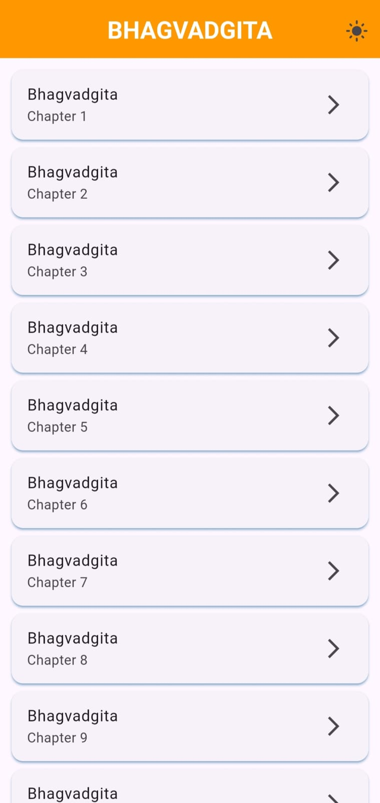
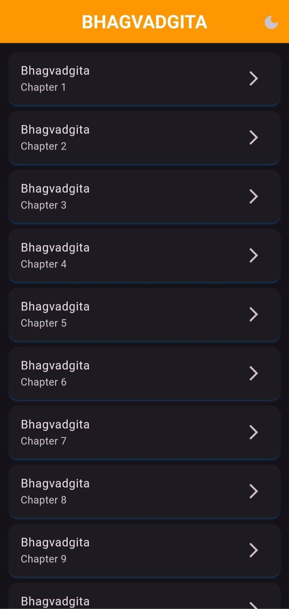
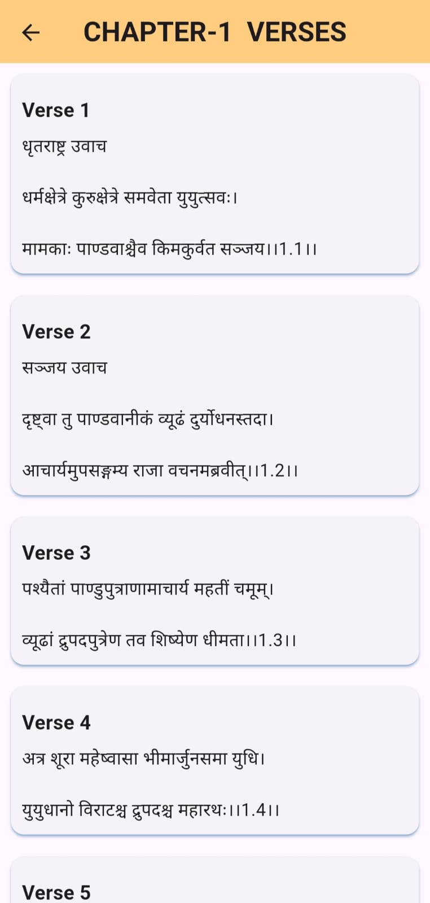
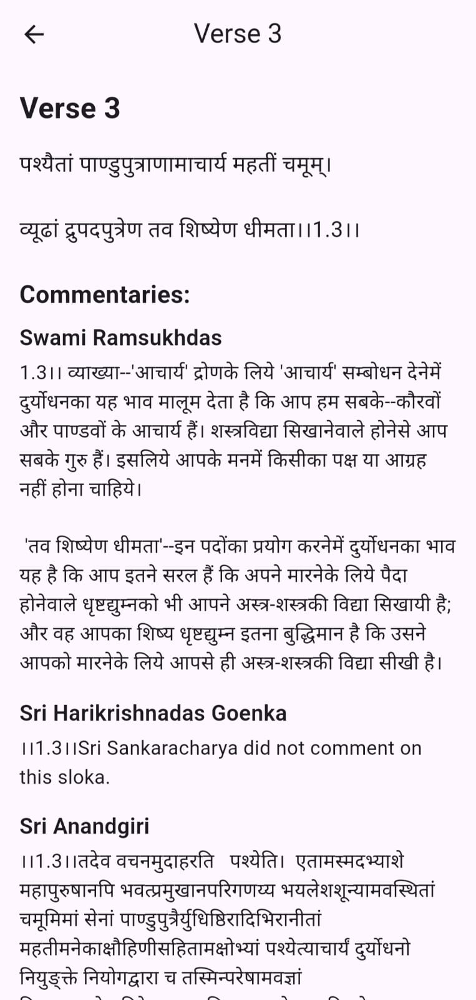
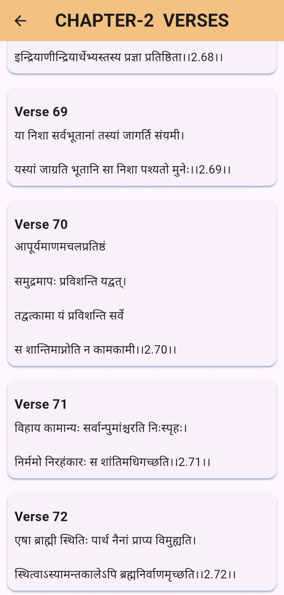
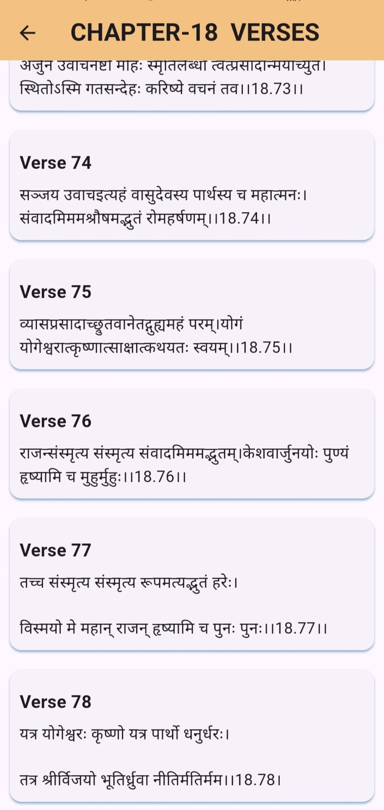
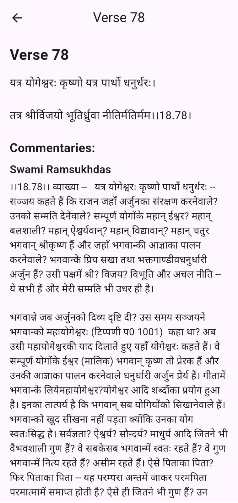

# 📖 Bhagavad Gita App 🕉️

Welcome to the **Bhagavad Gita App**! This app is designed to bring the timeless wisdom of the Bhagavad Gita to your fingertips. Whether you're seeking spiritual guidance, philosophical insights, or simply wish to explore the teachings of Lord Krishna, this app provides a seamless and enriching experience.

---

## 🌟 Features

- **Verse of the Day**: Start your day with a randomly selected verse from the Bhagavad Gita, complete with meaning and commentary.
- **Chapter Navigation**: Easily navigate through all 18 chapters (Adhyayas) and 700+ verses (Shlokas).
- **Multiple Languages**: Read the Bhagavad Gita in multiple languages, including English, Hindi, Sanskrit, and more.
- **Dark Mode**: Read comfortably in low-light conditions with the dark mode feature.

---

## 🕉️ Available Content

### Chapters (Adhyayas)
1. **Arjuna Vishada Yoga** (The Yoga of Arjuna's Dejection)
2. **Sankhya Yoga** (The Yoga of Knowledge)
3. **Karma Yoga** (The Yoga of Action)
4. **Jnana Yoga** (The Yoga of Wisdom)
5. **Karma Sanyasa Yoga** (The Yoga of Renunciation of Action)
6. **Dhyana Yoga** (The Yoga of Meditation)
7. **Jnana Vijnana Yoga** (The Yoga of Knowledge and Realization)
8. **Akshara Brahma Yoga** (The Yoga of the Imperishable Brahman)
9. **Raja Vidya Yoga** (The Yoga of the Kingly Knowledge)
10. **Vibhuti Yoga** (The Yoga of Divine Glories)
11. **Vishvarupa Darshana Yoga** (The Yoga of the Vision of the Universal Form)
12. **Bhakti Yoga** (The Yoga of Devotion)
13. **Kshetra Kshetrajna Vibhaga Yoga** (The Yoga of the Field and the Knower of the Field)
14. **Gunatraya Vibhaga Yoga** (The Yoga of the Division of the Three Gunas)
15. **Purushottama Yoga** (The Yoga of the Supreme Person)
16. **Daivasura Sampad Vibhaga Yoga** (The Yoga of the Division between the Divine and the Demoniacal)
17. **Shraddhatraya Vibhaga Yoga** (The Yoga of the Threefold Faith)
18. **Moksha Sanyasa Yoga** (The Yoga of Liberation and Renunciation)

---

## 🖼️ Screenshots

Check out some screenshots of the app in action:
















---

## 🚀 Getting Started

To get started with the **Bhagavad Gita App**, simply download and install the app on your device. Open the app, select your desired chapter or verse, and immerse yourself in the divine wisdom of the Gita.

---

## 🔧 Clone the Repo

To get a local copy of the project, follow these steps:

1. **Open your terminal or command prompt.**
2. **Clone the repository:**
   ```bash
   git clone https://github.com/Vishakha1510/bhagavad-gita-app.git


Enjoy your spiritual journey with the Bhagavad Gita App! 🕉️🎉
